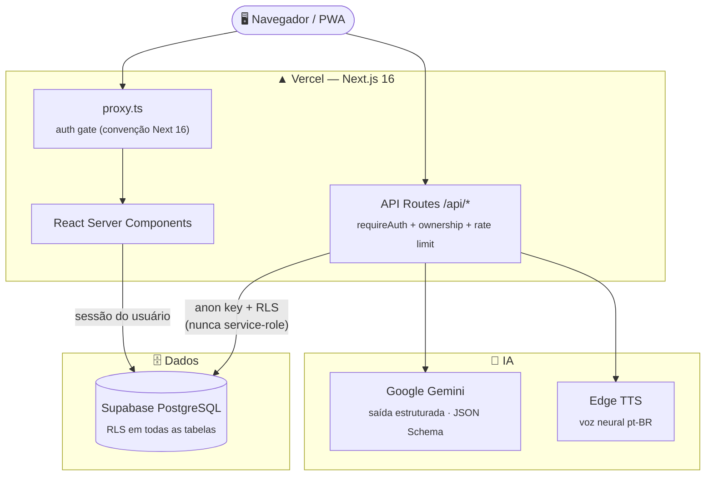
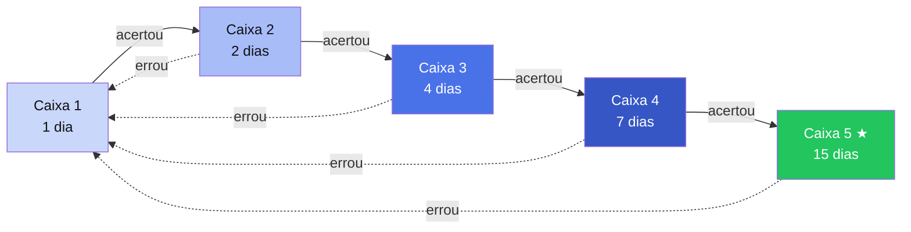

<div align="center">


# gabarito_AI

**Console de estudos para concursos públicos, alimentado por inteligência artificial.**

Suba o edital em PDF → a IA monta seu plano, flashcards, questões comentadas, resumos e até podcast.

[](https://nextjs.org)
[](https://www.typescriptlang.org)
[](https://supabase.com)
[](https://ai.google.dev)
[](https://tailwindcss.com)
[](LICENSE)

**[🌐 App ao vivo](https://gabarito-lyart.vercel.app)** · **[✨ Landing page](https://gabarito-lyart.vercel.app/sobre)** · **[👨‍💻 Autor](https://cielioqueiroz.github.io/)**

<br/>


</div>

---

## Por que existe

Estudar para concurso é transformar um edital de 40 páginas em meses de estudo organizado — e a maioria faz isso na mão, em planilha. O **gabarito_AI** automatiza o trabalho pesado:

> **Edital em PDF entra → plano de estudos estruturado, flashcards com repetição espaçada, questões de banca comentadas, resumos e podcast em voz neural saem.**

Feito por um concurseiro, para concurseiros. Projeto aberto (MIT), roda inteiro em serviços com camada gratuita.

---

## Funcionalidades

| | Feature | Descrição |
|---|---|---|
| 📄 | **Upload de edital** | PDF ou TXT (até 5 MB) → IA extrai e organiza disciplinas + tópicos automaticamente |
| 🗂️ | **Plano de estudos** | Checklist por disciplina com progresso visual e registro de `estudado_em` para analytics |
| 🧠 | **Flashcards Leitner** | 5 caixas com agendamento automático de revisão (1 / 2 / 4 / 7 / 15 dias) |
| ✅ | **Questões com IA** | Múltipla escolha com gabarito e explicação comentada, no estilo das bancas |
| 📝 | **Resumos com IA** | Gerados da disciplina, de um texto colado, de um link ou de um vídeo do YouTube |
| 🎧 | **Podcast** | Narração neural pt-BR de cada resumo (Edge TTS) — player com velocidade e download |
| 🔁 | **Revisão do Dia** | Sessão diária com todos os cards vencidos, cruzando todos os concursos |
| 📊 | **Estatísticas** | KPIs de acerto, gráfico dos últimos 7 dias e desempenho por disciplina |
| ⌨️ | **Atalhos** | `Espaço` vira o card · `1/J` errei · `2/K` acertei · `U` desfazer |
| 🔐 | **Login social** | E-mail/senha, Google e GitHub (PKCE via Supabase Auth) |
| 📱 | **PWA + responsivo** | Instalável em mobile/desktop, dark/light sem FOUC |

<div align="center">
<table>
  <tr>
    <td align="center"><br/><sub>Do edital ao domínio, em 4 passos</sub></td>
    <td align="center"><br/><sub>Login social + Three.js</sub></td>
  </tr>
</table>
</div>

---

## Arquitetura



**Decisões de arquitetura que importam:**

- **RLS em 100% das tabelas** com `USING` + `WITH CHECK` — o servidor usa apenas a anon key com a sessão do usuário; não existe caminho que contorne as policies.
- **Toda rota de IA** valida sessão (`getUser()` server-side), confere ownership da disciplina/concurso e aplica rate limit por usuário **antes** de gastar tokens.
- **Saída estruturada** (JSON Schema) em vez de regex sobre markdown — a IA não tem como quebrar o parser.
- **Guard SSRF** na ingestão de links: redirects re-validados salto a salto, IP-literal bloqueado, corpo lido em stream com teto de 2 MB.

<details>
<summary><b>📁 Estrutura do projeto</b> (clique para expandir)</summary>

```
gabarito_AI/
├── app/
│   ├── api/
│   │   ├── criar-com-edital/   # Upload + extração + geração do plano via IA (com rollback)
│   │   ├── gerar-flashcards/   # Geração de cards por disciplina
│   │   ├── gerar-questoes/     # Geração de questões com alternativas
│   │   ├── gerar-resumo/       # Resumo de disciplina, texto, link ou YouTube
│   │   ├── podcast/[resumoId]/ # MP3 neural pt-BR do resumo (Edge TTS)
│   │   ├── gerar-plano/        # Reimportação de edital
│   │   └── stream-plano/       # Versão streaming para feedback incremental
│   ├── auth/callback/          # Troca de código PKCE (OAuth + e-mail)
│   ├── concurso/[id]/          # Detalhes do concurso (plano, flashcards, questões, resumos)
│   ├── revisao/                # Revisão do Dia (Leitner cross-concurso)
│   ├── estatisticas/           # KPIs + gráfico 7 dias + desempenho por disciplina
│   └── login/                  # Login/signup/forgot + OAuth + Three.js
├── components/                 # UI (shadcn/ui + Framer Motion + Three.js)
├── lib/
│   ├── anthropic.ts            # Cliente Gemini (nome legado) — saída estruturada + retry
│   ├── apiHelpers.ts           # requireAuth, checkRateLimit, ownership checks
│   ├── leitner.ts              # Caixas 1–5, intervalos, isDue()
│   └── supabase/               # Clientes server e browser
├── supabase/
│   ├── schema.sql              # DDL completo: RLS, índices, views e triggers
│   └── seed.sql                # Seed — BB Agente de Tecnologia 2023
├── proxy.ts                    # Auth gate (substitui middleware.ts no Next 16)
└── next.config.ts              # CSP, HSTS e demais security headers
```

</details>

---

## O método Leitner

Cada acerto promove o card para uma caixa com intervalo maior; um erro devolve para a primeira. Você revisa exatamente quando está prestes a esquecer.



Cards da caixa 4+ contam como **dominados** no cálculo de progresso.

---

## Stack

| Camada | Tecnologia |
|---|---|
| Framework | **Next.js 16** — App Router, RSC, async params, `proxy.ts` |
| Banco | **Supabase** — PostgreSQL + Auth (PKCE) + Row Level Security |
| IA | **Google Gemini** `gemini-flash-latest` — saída estruturada, camada gratuita |
| Voz | **Microsoft Edge TTS** — neural pt-BR, sem chave, sem custo |
| Estilo | **Tailwind CSS v4** + shadcn/ui — identidade "Meia-noite & Azul-caneta" |
| Motion | **Framer Motion** + **Three.js** (partículas com parallax) |
| Linguagem | **TypeScript** strict |
| Deploy | **Vercel** — push na `main` = deploy |

---

## Rodando localmente

> **Pré-requisitos:** Node 20+, conta no [Supabase](https://supabase.com) e uma chave gratuita do [Google AI Studio](https://aistudio.google.com/apikey).

```bash
git clone https://github.com/cielioqueiroz/gabarito_AI.git
cd gabarito_AI
npm install
```

Crie `.env.local`:

```env
NEXT_PUBLIC_SUPABASE_URL=https://xxxx.supabase.co
NEXT_PUBLIC_SUPABASE_ANON_KEY=eyJ...
GEMINI_API_KEY=AIza...
```

Execute no SQL Editor do Supabase: `supabase/schema.sql` (obrigatório) e `supabase/seed.sql` (opcional — dados de exemplo do BB 2023). Depois:

```bash
npm run dev        # http://localhost:3000
npm run typecheck  # tsc --noEmit
npm run build      # build de produção
```

<details>
<summary><b>🔐 Login social (opcional)</b></summary>

1. Crie um OAuth Client no **Google Cloud** e/ou um OAuth App no **GitHub** com callback:
   `https://<projeto>.supabase.co/auth/v1/callback`
2. Ative os providers em **Supabase → Authentication → Sign In / Providers** colando Client ID + Secret.
3. Em **URL Configuration → Redirect URLs**, adicione `http://localhost:3000/**` e sua URL de produção com `/**`.

</details>

<details>
<summary><b>☁️ Deploy na Vercel</b></summary>

[](https://vercel.com/new/clone?repository-url=https%3A%2F%2Fgithub.com%2Fcielioqueiroz%2Fgabarito_AI&env=NEXT_PUBLIC_SUPABASE_URL,NEXT_PUBLIC_SUPABASE_ANON_KEY,GEMINI_API_KEY&envDescription=Chaves%20do%20Supabase%20e%20do%20Google%20Gemini&envLink=https%3A%2F%2Fgithub.com%2Fcielioqueiroz%2Fgabarito_AI%23rodando-localmente)

1. Importe o repositório e configure as 3 variáveis de ambiente acima.
2. Cada push na `main` gera deploy automático.
3. Para múltiplas instâncias em produção, troque o rate limiter in-memory por `@upstash/ratelimit`.

</details>

---

## API

Todas as rotas exigem sessão autenticada, checam ownership antes de chamar a IA e têm rate limit por usuário.

| Endpoint | Método | Rate limit | Descrição |
|---|---|---|---|
| `/api/criar-com-edital` | `POST` multipart | 5/min | Cria concurso + processa edital + gera plano |
| `/api/gerar-plano` | `POST` | 5/min | Gera/reimporta plano a partir de texto |
| `/api/gerar-flashcards` | `POST` | 10/min | Flashcards por disciplina |
| `/api/gerar-questoes` | `POST` | 10/min | Questões de múltipla escolha comentadas |
| `/api/gerar-resumo` | `POST` | 10/min | Resumo de disciplina, texto, link ou YouTube |
| `/api/podcast/[resumoId]` | `GET` | 20/min | MP3 do resumo em voz neural pt-BR |
| `/api/stream-plano` | `POST` | 5/min | Streaming chunk-a-chunk do plano |

---

## Segurança

- **Row Level Security** em todas as tabelas — policies `USING` + `WITH CHECK` bloqueiam leitura *e* escrita cruzada.
- **Menor privilégio**: o app usa somente a anon key + sessão; a service-role key não existe no ambiente.
- **Guard SSRF** na ingestão de URLs (redirects re-validados, IP-literal bloqueado, corpo com teto).
- **Security headers** globais: CSP, HSTS + preload, `X-Frame-Options: DENY`, nosniff, COOP/CORP.
- **Rate limiting** por usuário em todas as rotas de IA; upload limitado a 5 MB.
- Env vars validadas em runtime (`lib/env.ts`) — falha rápido se algo faltar.

---

## Autor

<div align="center">

Feito com ☕ e método por **[Cielio Queiroz](https://cielioqueiroz.github.io/)**

[](https://cielioqueiroz.github.io/)
[](https://github.com/cielioqueiroz)

Licença **MIT** — use, modifique e distribua livremente.

© 2026 Cielio Queiroz. Todos os direitos reservados sobre a marca e identidade visual.

</div>
