<div align="center">


# gabarito_AI

**Console de estudos para concursos públicos, alimentado por inteligência artificial.**

Suba o edital em PDF → a IA monta seu plano, flashcards, questões comentadas, resumos e até podcast.

[](https://nextjs.org)
[](https://www.typescriptlang.org)
[](https://supabase.com)
[](https://ai.google.dev)
[](https://tailwindcss.com)
[](LICENSE)

**[🌐 App ao vivo](https://gabarito-lyart.vercel.app)** · **[✨ Landing page](https://gabarito-lyart.vercel.app/sobre)** · **[👨‍💻 Autor](https://cielioqueiroz.github.io/)**

<sub>Entre com <code>teste@gabarito.app</code> / <code>gabarito123</code> para ver o app com dados reais.</sub>

<br/>

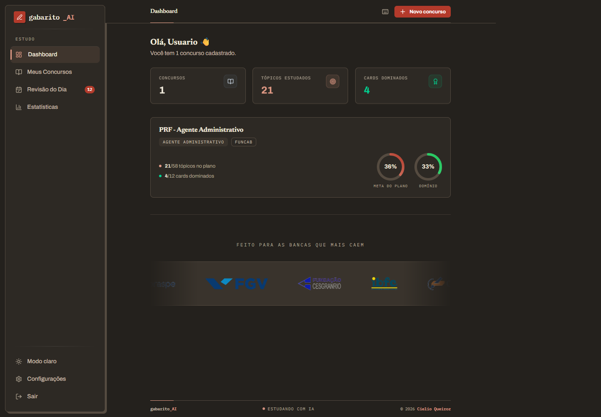

<sub>Dashboard real — concurso montado sozinho a partir do PDF de uma prova da FUNCAB/PRF</sub>

</div>

---

## Por que existe

Estudar para concurso é transformar um edital de 40 páginas em meses de estudo organizado — e a maioria faz isso na mão, em planilha. O **gabarito_AI** automatiza o trabalho pesado:

> **Edital ou prova entra (PDF, foto ou escaneado) → plano de estudos estruturado, as questões reais da prova já cadastradas, flashcards com repetição espaçada, resumos e podcast em voz neural saem.**

Feito por um concurseiro, para concurseiros. Projeto aberto (MIT), roda inteiro em serviços com camada gratuita.

---

## Funcionalidades

| | Feature | Descrição |
|---|---|---|
| 📄 | **Lê edital ou prova** | PDF, foto (JPG/PNG) ou TXT. Detecta sozinho o que é o documento e lê da primeira à última página — inclusive **PDF escaneado, via OCR do modelo** |
| ✍️ | **Zero digitação** | Só o arquivo basta: nome, banca, cargo e ano saem do próprio documento. Nenhum campo é obrigatório quando há upload |
| 🎯 | **Importa a prova de verdade** | As questões da prova anterior viram questões respondíveis no app, com gabarito, comentário e a numeração original |
| ⚖️ | **Peso por disciplina** | Descobre quantas questões a banca cobra de cada disciplina, para você priorizar o que cai mais |
| 🗂️ | **Plano de estudos** | Checklist por disciplina com progresso visual e registro de `estudado_em` para analytics |
| 🧠 | **Flashcards Leitner** | 5 caixas com agendamento automático de revisão (1 / 2 / 4 / 7 / 15 dias) |
| ✅ | **Questões com IA** | Múltipla escolha com gabarito e explicação comentada, no estilo das bancas |
| 📝 | **Resumos com IA** | Gerados da disciplina, de um texto colado, de um link ou de um vídeo do YouTube |
| 🎧 | **Podcast** | Narração neural pt-BR de cada resumo (Edge TTS) — player com velocidade e download |
| 🔁 | **Revisão do Dia** | Sessão diária com todos os cards vencidos, cruzando todos os concursos |
| 📊 | **Estatísticas** | KPIs de acerto, gráfico dos últimos 7 dias e desempenho por disciplina |
| ⌨️ | **Atalhos** | `Espaço` vira o card · `1/J` errei · `2/K` acertei · `U` desfazer |
| 🔐 | **Login social** | E-mail/senha, Google e GitHub (PKCE via Supabase Auth) |
| 📱 | **PWA + responsivo** | Instalável em mobile/desktop, dark/light sem FOUC |

<div align="center">
<table>
  <tr>
    <td align="center" width="50%">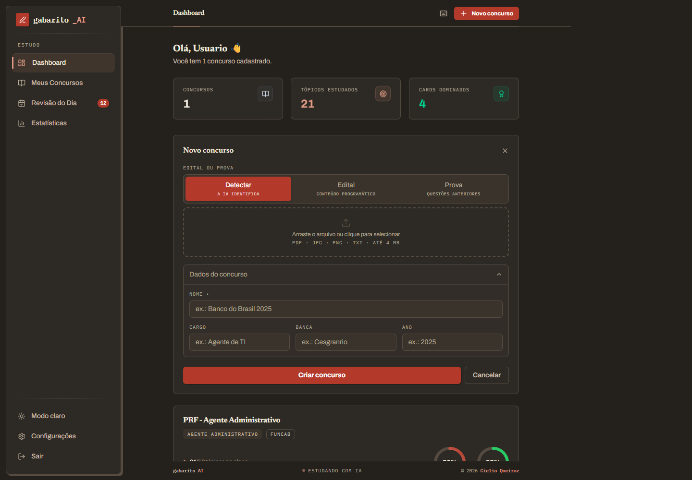<br/><sub><b>Zero digitação</b> — anexou o PDF, os campos somem. Nome, banca e cargo saem do documento</sub></td>
    <td align="center" width="50%">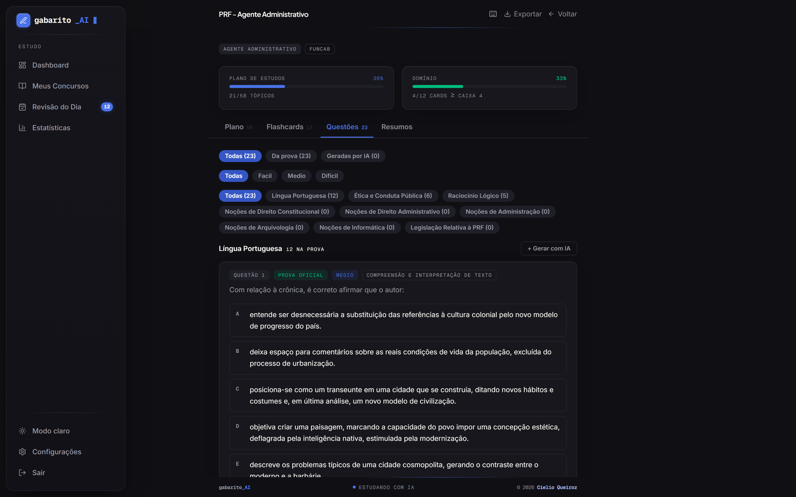<br/><sub><b>Questões reais da prova</b> — badge de origem, numeração original e peso da disciplina</sub></td>
  </tr>
  <tr>
    <td align="center">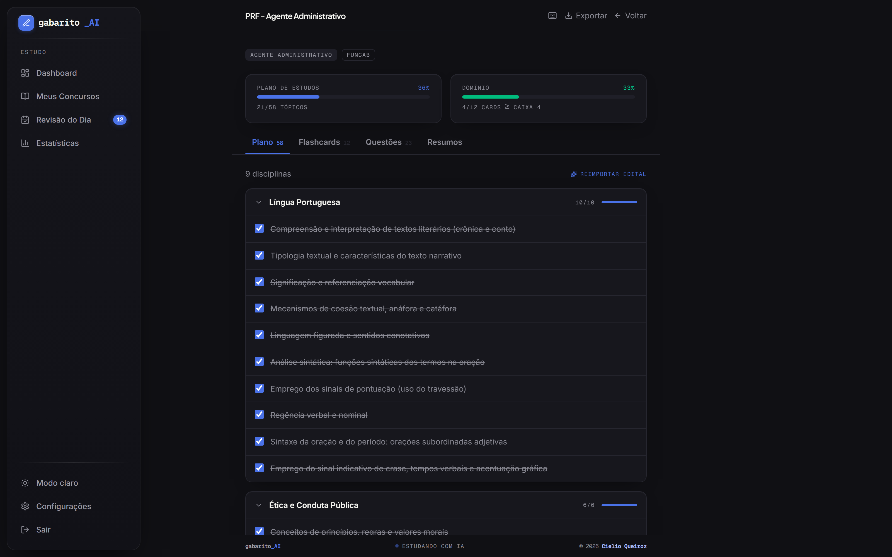<br/><sub>Plano extraído do documento, com progresso por disciplina</sub></td>
    <td align="center">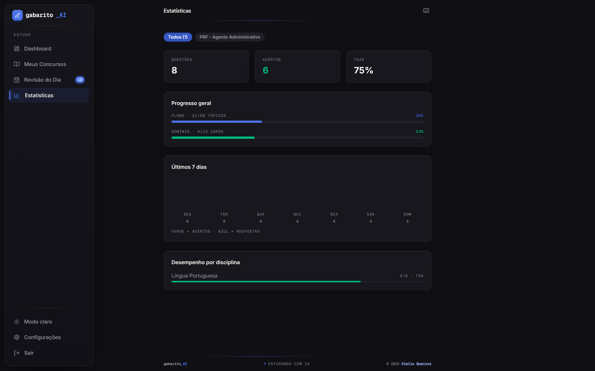<br/><sub>Acertos, evolução e desempenho por disciplina</sub></td>
  </tr>
  <tr>
    <td align="center">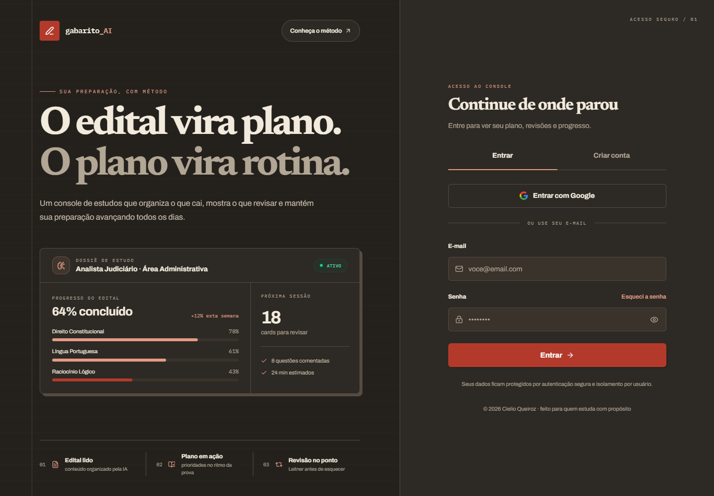<br/><sub>Login social (Google · GitHub) com fundo Three.js</sub></td>
    <td align="center">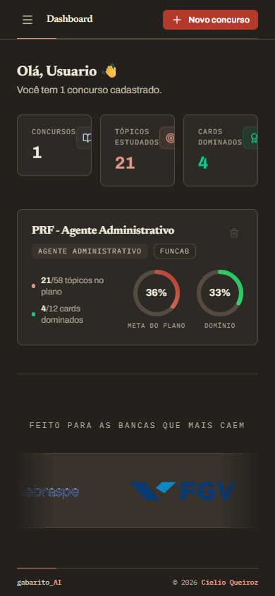<br/><sub>PWA instalável, responsivo</sub></td>
  </tr>
  <tr>
    <td align="center" colspan="2">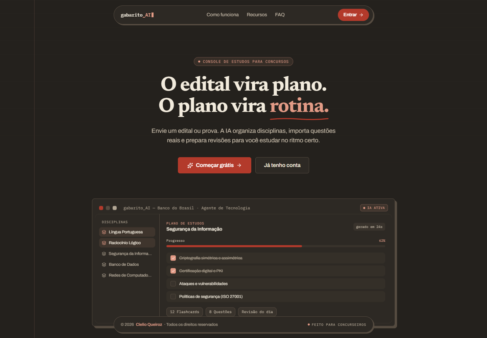<br/><sub>Landing pública em <code>/sobre</code></sub></td>
  </tr>
</table>
</div>

> Todos os prints são do app rodando, com um concurso montado de ponta a ponta pela própria pipeline a partir do PDF de uma prova real — nenhum dado foi inserido à mão.

---

## Como o gabarito lê provas e editais

Ler o documento inteiro é o ponto onde quase tudo dá errado — e onde este projeto foi medido contra uma prova real: **FUNCAB / PRF 2014, 18 páginas, 4 MB, com páginas escaneadas**.

### O que mudou

| | Pipeline anterior | Hoje |
|---|---|---|
| Quanto do documento a IA via | **22%** — cortava na questão 06 de 60 | **100%** — as 18 páginas |
| Disciplinas encontradas | 1 (só Português) | **9** |
| Questões aproveitadas | 0 | **60**, transcritas com gabarito |
| PDF escaneado | falhava | lido por OCR do modelo |
| Banca / cargo | digitados na mão | detectados do documento |


```mermaid
xychart-beta
    title "Prova FUNCAB/PRF 2014 — 18 páginas, 60 questões"
    x-axis ["Páginas lidas", "Disciplinas achadas", "Questões aproveitadas"]
    y-axis "quantidade" 0 --> 60
    bar "antes" [4, 1, 0]
    bar "depois" [18, 9, 60]
```

A causa era um só número: `MAX_EDITAL_CHARS = 12000`. Num **edital** o estrago é ainda pior que numa prova, porque o conteúdo programático mora num **anexo no fim do arquivo** — exatamente a parte que o corte descartava. Hoje o teto é 300k caracteres, dentro da janela de 1M de tokens do modelo.

### O caminho do arquivo

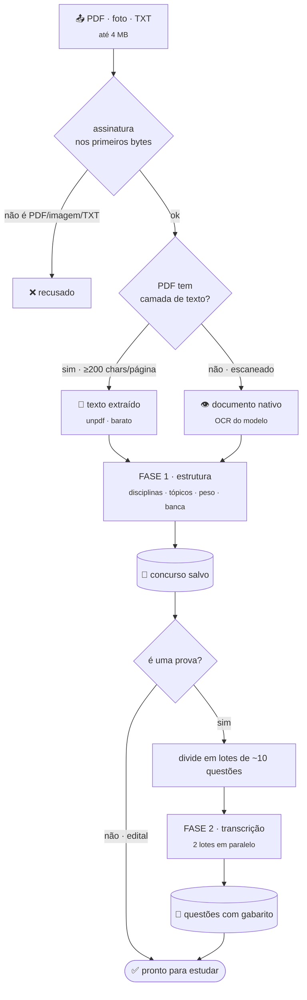
```mermaid
flowchart TB
    U["📤 PDF · foto · TXT<br/><sub>até 4 MB</sub>"]
    V{"assinatura<br/>nos primeiros bytes"}
    X["❌ recusado"]
    D{"PDF tem<br/>camada de texto?"}
    T["📝 texto extraído<br/><sub>unpdf · barato</sub>"]
    N["👁️ documento nativo<br/><sub>OCR do modelo</sub>"]

    F1["FASE 1 · estrutura<br/><sub>disciplinas · tópicos · peso · banca</sub>"]
    DB[("💾 concurso salvo")]
    Q{"é uma prova?"}
    L["divide em lotes de ~10 questões"]
    F2["FASE 2 · transcrição<br/><sub>2 lotes em paralelo</sub>"]
    QB[("💾 questões com gabarito")]
    FIM(["✅ pronto para estudar"])

    U --> V
    V -->|"não é PDF/imagem/TXT"| X
    V -->|ok| D
    D -->|"sim · ≥200 chars/página"| T
    D -->|"não · escaneado"| N
    T --> F1
    N --> F1
    F1 --> DB --> Q
    Q -->|não · edital| FIM
    Q -->|sim| L --> F2 --> QB --> FIM
```

**Por que duas fases.** Pedir estrutura + 60 questões numa chamada só leva **54 s** e devolve JSON cortado quando estoura o teto de tokens de saída — perdendo tudo. Separando, a fase 1 grava o plano em ~22 s e a fase 2 transcreve em lotes independentes: um lote que falhe não derruba os outros nem o plano.

**Por que o lote é medido em questões, não em disciplinas.** O que enche a resposta é o volume transcrito, e uma disciplina pode ter 6 ou 20 questões. Usando o peso que a fase 1 descobre, a prova da PRF vira 5 lotes equilibrados de 12 questões em vez de 9 desiguais — quase metade das requisições. A regra está coberta por teste (`npm test`).

**Por que uma cadeia de modelos.** Os apelidos `-latest` do Gemini apontam para o modelo mais novo, que é justamente o que satura primeiro: durante o desenvolvimento, `gemini-flash-latest` respondia `503 high demand` enquanto `gemini-3.6-flash` ia normalmente. A camada de IA percorre uma lista de modelos em vez de insistir num só.

> **Latência é instável por natureza aqui:** o mesmo documento foi processado em **22 s** e em **82 s**, dependendo da carga do Google. Por isso as rotas de ingestão usam `maxDuration = 300` (requer Fluid Compute) e o cliente repete uma vez em falha transitória.

### Testando a extração sem subir nada

Prompts e schemas ficam isolados em `lib/extracao.ts`, então dá para exercitar a parte que decide a qualidade do resultado contra um arquivo real:

```bash
npm run avaliar -- caminho/para/prova.pdf --questoes
```

Ele reporta o modo de leitura escolhido, as disciplinas e pesos encontrados, o tempo de cada fase, o modelo que respondeu e quantas questões passariam na validação da rota.

---

## Arquitetura

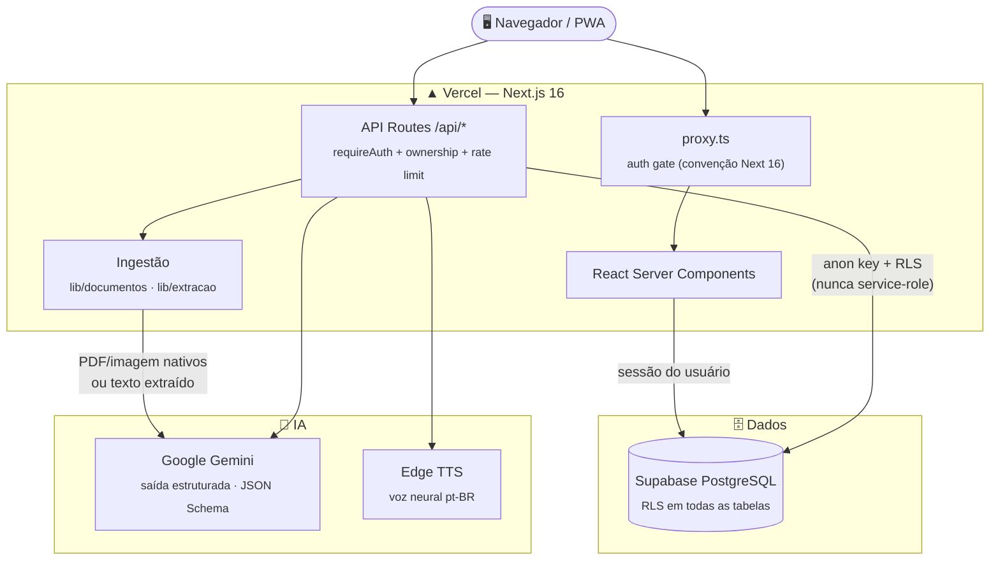
```mermaid
flowchart TB
    B(["🖥️ Navegador / PWA"])

    subgraph V["▲ Vercel — Next.js 16"]
        P["proxy.ts<br/><sub>auth gate (convenção Next 16)</sub>"]
        R["React Server Components"]
        A["API Routes /api/*<br/><sub>requireAuth + ownership + rate limit</sub>"]
        I["Ingestão<br/><sub>lib/documentos · lib/extracao</sub>"]
    end

    subgraph D["🗄️ Dados"]
        S[("Supabase PostgreSQL<br/><sub>RLS em todas as tabelas</sub>")]
    end

    subgraph IA["🤖 IA"]
        G["Google Gemini<br/><sub>saída estruturada · JSON Schema</sub>"]
        T["Edge TTS<br/><sub>voz neural pt-BR</sub>"]
    end

    B --> P --> R
    B --> A
    A --> I
    R -->|"sessão do usuário"| S
    A -->|"anon key + RLS<br/>(nunca service-role)"| S
    I -->|"PDF/imagem nativos<br/>ou texto extraído"| G
    A --> G
    A --> T
```

**Decisões de arquitetura que importam:**

- **RLS em 100% das tabelas** com `USING` + `WITH CHECK` — o servidor usa apenas a anon key com a sessão do usuário; não existe caminho que contorne as policies.
- **Toda rota de IA** valida sessão (`getUser()` server-side), confere ownership da disciplina/concurso e aplica rate limit por usuário **antes** de gastar tokens.
- **Saída estruturada** (JSON Schema) em vez de regex sobre markdown — a IA não tem como quebrar o parser.
- **Guard SSRF** na ingestão de links: redirects re-validados salto a salto, IP-literal bloqueado, corpo lido em stream com teto de 2 MB.
- **Arquivo validado por assinatura**, não por extensão ou `Content-Type` — os dois vêm de quem envia; os primeiros bytes, não.
- **A saída da IA é entrada não confiável**: antes de gravar, toda questão passa por validação de letra correta, faixa de numeração e tamanho de campo. O que não passa é descartado, não corrigido.
- **Prompts fora das rotas** (`lib/extracao.ts`): é a parte que mais muda e a única testável contra documentos reais sem servidor nem banco.

<details>
<summary><b>📁 Estrutura do projeto</b> (clique para expandir)</summary>

```
gabarito_AI/
├── app/
│   ├── api/
│   │   ├── criar-com-edital/   # FASE 1 — lê o documento e monta o plano (com rollback)
│   │   ├── importar-questoes/  # FASE 2 — transcreve as questões reais da prova, em lotes
│   │   ├── gerar-flashcards/   # Geração de cards por disciplina
│   │   ├── gerar-questoes/     # Geração de questões com alternativas
│   │   ├── gerar-resumo/       # Resumo de disciplina, texto, link ou YouTube
│   │   ├── podcast/[resumoId]/ # MP3 neural pt-BR do resumo (Edge TTS)
│   │   ├── gerar-plano/        # Reimportação de edital
│   │   └── stream-plano/       # Versão streaming para feedback incremental
│   ├── auth/callback/          # Troca de código PKCE (OAuth + e-mail)
│   ├── concurso/[id]/          # Detalhes do concurso (plano, flashcards, questões, resumos)
│   ├── revisao/                # Revisão do Dia (Leitner cross-concurso)
│   ├── estatisticas/           # KPIs + gráfico 7 dias + desempenho por disciplina
│   └── login/                  # Login/signup/forgot + OAuth + Three.js
├── components/                 # UI (shadcn/ui + Framer Motion + Three.js)
│   └── NovoConcursoForm.tsx    # Formulário único de criação + progresso das 2 fases
├── lib/
│   ├── anthropic.ts            # Cliente Gemini (nome legado) — saída estruturada + cadeia de modelos
│   ├── documentos.ts           # Validação por assinatura + escolha texto vs. OCR nativo
│   ├── extracao.ts             # Prompts e schemas da extração (testáveis isoladamente)
│   ├── apiHelpers.ts           # requireAuth, checkRateLimit, ownership checks
│   ├── leitner.ts              # Caixas 1–5, intervalos, isDue()
│   └── supabase/               # Clientes server e browser
├── scripts/
│   ├── avaliar-extracao.mjs    # Roda os prompts reais contra uma prova/edital de verdade
│   └── testar-lotes.mjs        # Testes do loteamento de disciplinas
├── supabase/
│   ├── schema.sql              # DDL completo: RLS, índices, views e triggers
│   ├── migrations/             # Alterações incrementais (idempotentes)
│   └── seed.sql                # Seed — BB Agente de Tecnologia 2023
├── proxy.ts                    # Auth gate (substitui middleware.ts no Next 16)
└── next.config.ts              # CSP, HSTS e demais security headers
```

</details>

---

## O método Leitner

Cada acerto promove o card para uma caixa com intervalo maior; um erro devolve para a primeira. Você revisa exatamente quando está prestes a esquecer.

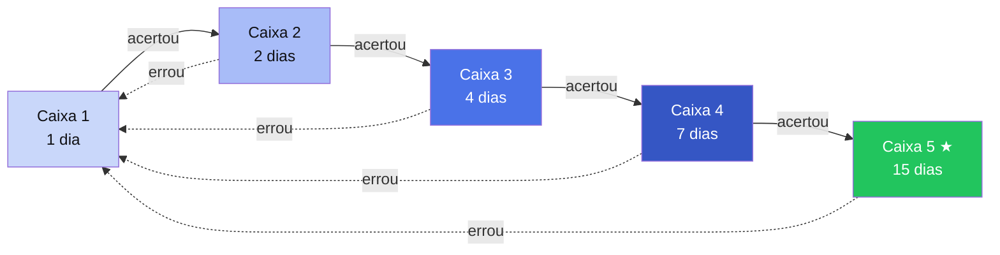
```mermaid
flowchart LR
    C1["Caixa 1<br/>1 dia"] -->|acertou| C2["Caixa 2<br/>2 dias"]
    C2 -->|acertou| C3["Caixa 3<br/>4 dias"]
    C3 -->|acertou| C4["Caixa 4<br/>7 dias"]
    C4 -->|acertou| C5["Caixa 5 ★<br/>15 dias"]
    C2 -.->|errou| C1
    C3 -.->|errou| C1
    C4 -.->|errou| C1
    C5 -.->|errou| C1

    style C5 fill:#22C55E,color:#fff
    style C1 fill:#C9D7FA,color:#101014
    style C2 fill:#A8BCF8,color:#101014
    style C3 fill:#4A72E8,color:#fff
    style C4 fill:#3556C4,color:#fff
```

Cards da caixa 4+ contam como **dominados** no cálculo de progresso.

---

## Stack

| Camada | Tecnologia |
|---|---|
| Framework | **Next.js 16** — App Router, RSC, async params, `proxy.ts` |
| Banco | **Supabase** — PostgreSQL + Auth (PKCE) + Row Level Security |
| IA | **Google Gemini** — saída estruturada, leitura nativa de PDF/imagem, cadeia de modelos com fallback |
| Voz | **Microsoft Edge TTS** — neural pt-BR, sem chave, sem custo |
| Estilo | **Tailwind CSS v4** + shadcn/ui — identidade "Meia-noite & Azul-caneta" |
| Motion | **Framer Motion** + **Three.js** (partículas com parallax) |
| Linguagem | **TypeScript** strict |
| Deploy | **Vercel** — push na `main` = deploy |

---

## Rodando localmente

> **Pré-requisitos:** Node 20+, conta no [Supabase](https://supabase.com) e uma chave gratuita do [Google AI Studio](https://aistudio.google.com/apikey).

```bash
git clone https://github.com/cielioqueiroz/gabarito_AI.git
cd gabarito_AI
npm install
```

Crie `.env.local`:

```env
NEXT_PUBLIC_SUPABASE_URL=https://xxxx.supabase.co
NEXT_PUBLIC_SUPABASE_ANON_KEY=eyJ...
GEMINI_API_KEY=AIza...
```

Execute no SQL Editor do Supabase: `supabase/schema.sql` (obrigatório) e `supabase/seed.sql` (opcional — dados de exemplo do BB 2023). Depois:

```bash
npm run dev        # http://localhost:3000
npm run typecheck  # tsc --noEmit
npm run lint       # eslint (flat config — `next lint` não existe mais no Next 16)
npm test           # testes do loteamento de disciplinas
npm run build      # build de produção
```

> **Já tem o banco de uma versão anterior?** Rode também `supabase/migrations/20260814_ingestao_documentos.sql`. Ele adiciona as colunas que a importação de provas usa (`questoes.origem`, `numero`, `topico`, `disciplinas.peso`, `concursos.fonte`) e é idempotente — rodar duas vezes não quebra nada.

<details>
<summary><b>🔐 Login social (opcional)</b></summary>

1. Crie um OAuth Client no **Google Cloud** e/ou um OAuth App no **GitHub** com callback:
   `https://<projeto>.supabase.co/auth/v1/callback`
2. Ative os providers em **Supabase → Authentication → Sign In / Providers** colando Client ID + Secret.
3. Em **URL Configuration → Redirect URLs**, adicione `http://localhost:3000/**` e sua URL de produção com `/**`.

</details>

<details>
<summary><b>☁️ Deploy na Vercel</b></summary>

[](https://vercel.com/new/clone?repository-url=https%3A%2F%2Fgithub.com%2Fcielioqueiroz%2Fgabarito_AI&env=NEXT_PUBLIC_SUPABASE_URL,NEXT_PUBLIC_SUPABASE_ANON_KEY,GEMINI_API_KEY&envDescription=Chaves%20do%20Supabase%20e%20do%20Google%20Gemini&envLink=https%3A%2F%2Fgithub.com%2Fcielioqueiroz%2Fgabarito_AI%23rodando-localmente)

1. Importe o repositório e configure as 3 variáveis de ambiente acima.
2. Cada push na `main` gera deploy automático.
3. Para múltiplas instâncias em produção, troque o rate limiter in-memory por `@upstash/ratelimit`.

</details>

---

## API

Todas as rotas exigem sessão autenticada, checam ownership antes de chamar a IA e têm rate limit por usuário.

| Endpoint | Método | Rate limit | Descrição |
|---|---|---|---|
| `/api/criar-com-edital` | `POST` multipart | 5/min | **Fase 1** — lê edital/prova e cria o plano |
| `/api/importar-questoes` | `POST` multipart | 30/min | **Fase 2** — transcreve um lote de questões da prova |
| `/api/gerar-plano` | `POST` | 5/min | Gera/reimporta plano a partir de texto |
| `/api/gerar-flashcards` | `POST` | 10/min | Flashcards por disciplina |
| `/api/gerar-questoes` | `POST` | 10/min | Questões de múltipla escolha comentadas |
| `/api/gerar-resumo` | `POST` | 10/min | Resumo de disciplina, texto, link ou YouTube |
| `/api/podcast/[resumoId]` | `GET` | 20/min | MP3 do resumo em voz neural pt-BR |
| `/api/stream-plano` | `POST` | 5/min | Streaming chunk-a-chunk do plano |

---

## Segurança

- **Row Level Security** em todas as tabelas — policies `USING` + `WITH CHECK` bloqueiam leitura *e* escrita cruzada.
- **Menor privilégio**: o app usa somente a anon key + sessão; a service-role key não existe no ambiente.
- **Guard SSRF** na ingestão de URLs (redirects re-validados, IP-literal bloqueado, corpo com teto).
- **Security headers** globais: CSP, HSTS + preload, `X-Frame-Options: DENY`, nosniff, COOP/CORP.
- **Rate limiting** por usuário em todas as rotas de IA; upload limitado a 4 MB e validado pela assinatura do arquivo (não pela extensão).
- **Injeção de prompt**: o documento do usuário é sempre marcado como dado, nunca instrução — inclusive quando a instrução vem *impressa dentro do PDF*, que a leitura nativa também enxerga.
- **Saída do modelo tratada como não confiável**: campos medidos e validados antes do insert; valor fora do `CHECK` do banco é normalizado, não repassado.
- A chave da IA vai no header `x-goog-api-key`, não na query string, onde vazaria em log de proxy.
- Env vars validadas em runtime (`lib/env.ts`) — falha rápido se algo faltar.

---

## Autor

<div align="center">

Feito com ☕ e método por **[Cielio Queiroz](https://cielioqueiroz.github.io/)**

[](https://cielioqueiroz.github.io/)
[](https://github.com/cielioqueiroz)

Licença **MIT** — use, modifique e distribua livremente.

© 2026 Cielio Queiroz. Todos os direitos reservados sobre a marca e identidade visual.

</div>
